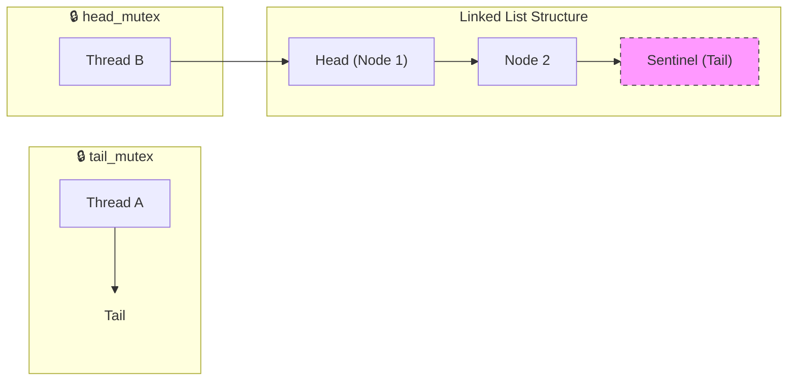

# ThreadSafe Blocking MPMC Unbounded Queue


A high-performance, multi-producer multi-consumer (MPMC) queue implementation utilizing a **fine-grained two-mutex** strategy and a **sentinel-node** architecture to minimize contention and maximize throughput.

---

## Concurrency Mechanics

This implementation prioritizes reduced lock contention by decoupling production and consumption through two key architectural decisions.

### 1. Fine-Grained Two-Mutex Strategy
Unlike a single-mutex queue that blocks all threads during any operation, this queue uses independent mutexes for the head and tail:
*   **`head_mutex`**: Guards the `pop` operations and head pointer updates.
*   **`tail_mutex`**: Guards the `push` operations and tail pointer updates.

This allows a producer and a consumer to operate concurrently on the queue as long as it contains more than one element.

### 2. Sentinel (Dummy) Node
The queue is initialized with a "dummy" node. The `tail` points to this dummy node, which never holds data. 
*   **Why?** In a single-element queue, the `head` and `tail` would normally point to the same node. Without a dummy node, a producer and consumer would contend for the same mutex. 
*   **The Invariant:** `tail` always points to the next available slot, separating the modification points of producers and consumers.

> This design effectively eliminates the "Empty Queue" race condition where a pop and push might collide on the same pointer, without requiring a global lock.

## Visual Architecture

The following diagram illustrates the decoupled access pattern. Notice how **Thread A** and **Thread B** can operate on opposite ends of the structure simultaneously.



## 🛠️ API Reference

| Method | Signature | Behavior | Blocking? |
| :--- | :--- | :--- | :--- |
| **Push** | `push(T value)` | Moves/Copies value into the queue. | No |
| **Emplace** | `emplace_back(Args&&...)` | Perfect-forwards args to construct `T` in-place. | No |
| **Pop (Wait)** | `wait_and_pop(T&)` | Blocks until an item is available. | **Yes** |
| **Pop (Try)** | `try_pop(T&)` | Returns `false` immediately if queue is empty. | No |
| **Pop (Timed)** | `wait_for_and_pop(T&, ms)` | Blocks until item available or timeout. | **Timed** |
| **Pop (Ptr)** | `wait_and_pop()` | Returns `std::shared_ptr<T>` (blocking). | **Yes** |
| **Empty** | `empty()` | Check if queue is empty (Snapshot). | No |

## Usage Example

```cpp
#include "tsfqueue.hpp"
#include <iostream>
#include <thread>

int main() {
    tsfqueue::__impl::blocking_mpmc_unbounded<int> queue;

    // Producer Thread
    std::jthread producer([&queue]() {
        for(int i = 0; i < 10; ++i) {
            queue.push(i);
            std::cout << "Pushed: " << i << "\n";
        }
    });

    // Consumer Thread
    std::jthread consumer([&queue]() {
        int val;
        while(true) {
            queue.wait_and_pop(val);
            std::cout << "Consumed: " << val << "\n";
            if (val == 9) break;
        }
    });

    return 0;
}
```
